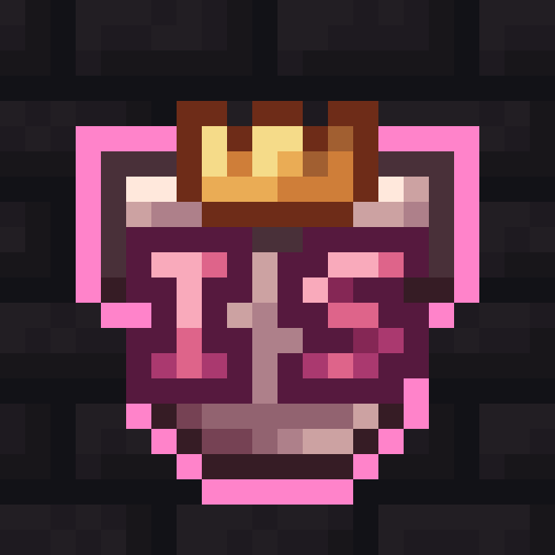

<!-- Improved compatibility of back to top link: See: https://github.com/Charliehyin/IMSBot/pull/73 -->
<a id="readme-top"></a>
<!--
*** Thanks for checking out the Best-README-Template. If you have a suggestion
*** that would make this better, please fork the repo and create a pull request
*** or simply open an issue with the tag "enhancement".
*** Don't forget to give the project a star!
*** Thanks again! Now go create something AMAZING! :D
-->


<!-- PROJECT SHIELDS -->
<!--
*** I'm using markdown "reference style" links for readability.
*** Reference links are enclosed in brackets [ ] instead of parentheses ( ).
*** See the bottom of this document for the declaration of the reference variables
*** for contributors-url, forks-url, etc. This is an optional, concise syntax you may use.
*** https://www.markdownguide.org/basic-syntax/#reference-style-links
-->
[![Contributors][contributors-shield]][contributors-url]
[![Forks][forks-shield]][forks-url]
[![Stargazers][stars-shield]][stars-url]
[![Issues][issues-shield]][issues-url]
[![MIT License][license-shield]][license-url]
[![LinkedIn][linkedin-shield]][linkedin-url]


<!-- PROJECT LOGO -->
<br />
<div align="center">
  <a href="https://github.com/Charliehyin/IMSBot">
    
  </a>

  <h3 align="center">IMS Bot</h3>

  <p align="center">
    A Custom Discord Bot made for the <a href="discord.gg/ims">IMS Discord Server</a>
    <br>
    <a href="https://github.com/Charliehyin/IMSBot/issues/new?labels=enhancement&template=feature-request---.md">Request Feature</a>
  </p>
</div>


<!-- TABLE OF CONTENTS -->
<details>
  <summary>Table of Contents</summary>
  <ol>
    <li>
      <a href="#about-the-project">About The Project</a>
      <ul>
        <li><a href="#built-with">Built With</a></li>
      </ul>
    </li>
    <li>
      <a href="#getting-started">Getting Started</a>
      <ul>
        <li><a href="#prerequisites">Prerequisites</a></li>
        <li><a href="#installation">Installation</a></li>
      </ul>
    </li>
    <li><a href="#usage">Usage</a></li>
    <li><a href="#roadmap">Roadmap</a></li>
    <li><a href="#contributing">Contributing</a></li>
    <li><a href="#license">License</a></li>
    <li><a href="#contact">Contact</a></li>
    <li><a href="#acknowledgments">Acknowledgments</a></li>
  </ol>
</details>


<!-- ABOUT THE PROJECT -->
## About The Project

IMS Bot is a customized Discord Bot made to accomplish all the automation needs of the IMS Discord Server. Here are some of it's key features: 

* Automatic message flagging using the OpenAI moderation API
* Guild application creation and management
* Punishment system with automatic logging 
* Guild blacklist system integrated with guild applications and verification
* Sync Discord roles with in-game statistics and guild information
* Verify members and flag suspicious new joins 
* Automatically update member count channels

This Discord bot is in ongoing development, and its features will change as the needs of IMS change over time. 

<p align="right">(<a href="#readme-top">back to top</a>)</p>

### Built With

* [![Node][Node.js]][Node-url]
* [![AWS][AWS]][AWS-url]
* [![OpenAI][OpenAI]][OpenAI-url]
* [![Hypixel][Hypixel]][Hypixel-url]


<p align="right">(<a href="#readme-top">back to top</a>)</p>


<!-- GETTING STARTED -->
## Getting Started

To get a copy of the bot up and running follow these example steps: 

**DISCLAIMER: Many channels/roles are hardcoded in /src/bot/constants.js. The bot will not work unless these are changed to ones valid for your server. The bot was made specifically for IMS.**

### Prerequisites

In order to run the bot, you need the following:
* npm
  ```sh
  npm install npm@latest -g
  ```
* A MySQL Database (I use [this](https://aws.amazon.com/rds/))
* A Discord Bot (create one [here](https://discord.com/developers/applications))
* A Hypixel API Key (get one [here](https://developer.hypixel.net/dashboard/apps))

### Installation

Assuming you have all the prerequisites, follow these steps to get the bot up and running. 

1. Clone the repo
   ```sh
   git clone https://github.com/Charliehyin/IMSBot.git
   ```
3. Install NPM packages
   ```sh
   npm install
   ```
4. Create a .env file in the root directory, and fill it in
   ```env
   DISCORD_TOKEN=<Token for the Discord bot>
   DB_HOST=<Link where database is hosted>
   DB_USER=<Username for database>
   DB_PASSWORD=<Password to the database>
   DB_NAME=<Name of the database>
   MODERATION_API_KEY=<Your OpenAI API key>
   HYPIXEL_API_KEY=<Your Hypixel API key>
   ```
5. Start the bot
   ```sh
   npm start
   ```

<p align="right">(<a href="#readme-top">back to top</a>)</p>


<!-- USAGE EXAMPLES -->
## Usage

Join [IMS](https://discord.gg/ims) to see the bot in action. 

<p align="right">(<a href="#readme-top">back to top</a>)</p>


<!-- ROADMAP 
## Roadmap

- [x] Add Changelog
- [x] Add back to top links
- [ ] Add Additional Templates w/ Examples
- [ ] Add "components" document to easily copy & paste sections of the readme
- [ ] Multi-language Support
    - [ ] Chinese
    - [ ] Spanish

See the [open issues](https://github.com/Charliehyin/IMSBot/issues) for a full list of proposed features (and known issues).

<p align="right">(<a href="#readme-top">back to top</a>)</p>
-->

<!-- CONTRIBUTING -->
## Contributing

Contributions are what make the open source community such an amazing place to learn, inspire, and create. Any contributions you make are **greatly appreciated**.

If you have a suggestion that would make this better, please fork the repo and create a pull request. You can also simply open an issue with the tag "enhancement".
Don't forget to give the project a star! Thanks again!

1. Fork the Project
2. Create your Feature Branch (`git checkout -b feature/AmazingFeature`)
3. Commit your Changes (`git commit -m 'Add some AmazingFeature'`)
4. Push to the Branch (`git push origin feature/AmazingFeature`)
5. Open a Pull Request

<p align="right">(<a href="#readme-top">back to top</a>)</p>


<!-- LICENSE -->
## License

Distributed under the MIT License. 

<p align="right">(<a href="#readme-top">back to top</a>)</p>


<!-- CONTACT -->
## Contact

Charlie Yin  - [Email](charlieyin@u.northwestern.edu), [LinkedIn](https://www.linkedin.com/in/charliehyin/)
Discord Username: realnitril


<p align="right">(<a href="#readme-top">back to top</a>)</p>


<!-- MARKDOWN LINKS & IMAGES -->
<!-- https://www.markdownguide.org/basic-syntax/#reference-style-links -->
[contributors-shield]: https://img.shields.io/github/contributors/charliehyin/IMSBot.svg?style=for-the-badge
[contributors-url]: https://github.com/Charliehyin/IMSBot/graphs/contributors
[forks-shield]: https://img.shields.io/github/forks/charliehyin/IMSBot.svg?style=for-the-badge
[forks-url]: https://github.com/Charliehyin/IMSBot/network/members
[stars-shield]: https://img.shields.io/github/stars/charliehyin/IMSBot.svg?style=for-the-badge
[stars-url]: https://github.com/Charliehyin/IMSBot/stargazers
[issues-shield]: https://img.shields.io/github/issues/charliehyin/IMSBot.svg?style=for-the-badge
[issues-url]: https://github.com/Charliehyin/IMSBot/issues
[license-shield]: https://img.shields.io/github/license/charliehyin/IMSBot.svg?style=for-the-badge
[license-url]: https://github.com/Charliehyin/IMSBot/blob/main/LICENSE.txt
[linkedin-shield]: https://img.shields.io/badge/-LinkedIn-black.svg?style=for-the-badge&logo=linkedin&colorB=555
[linkedin-url]: https://linkedin.com/in/charliehyin
[product-screenshot]: images/screenshot.png
[Node.js]: https://img.shields.io/badge/Node.js-43853D?style=for-the-badge&logo=node.js&logoColor=white
[Node-url]: https://nodejs.org
[AWS]: https://img.shields.io/badge/AWS-FF9900?style=for-the-badge&logo=amazonaws&logoColor=white
[AWS-url]: https://aws.amazon.com
[OpenAI]: https://img.shields.io/badge/OpenAI-74aa9c?style=for-the-badge&logo=openai&logoColor=white
[OpenAI-url]: https://openai.com/
[Hypixel]: https://img.shields.io/badge/Hypixel_API-ffc039?style=for-the-badge&logoColor=yellow
[Hypixel-url]: https://developer.hypixel.net/